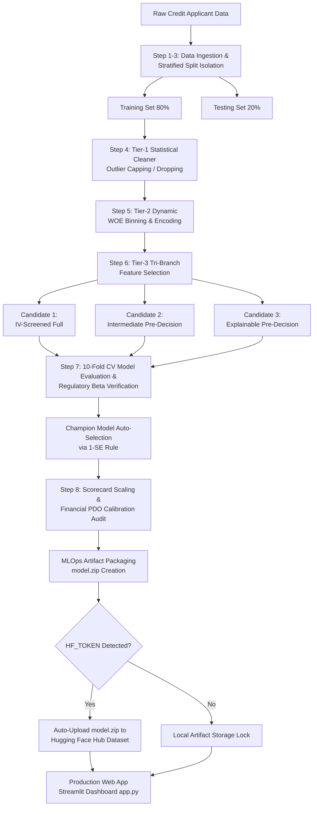
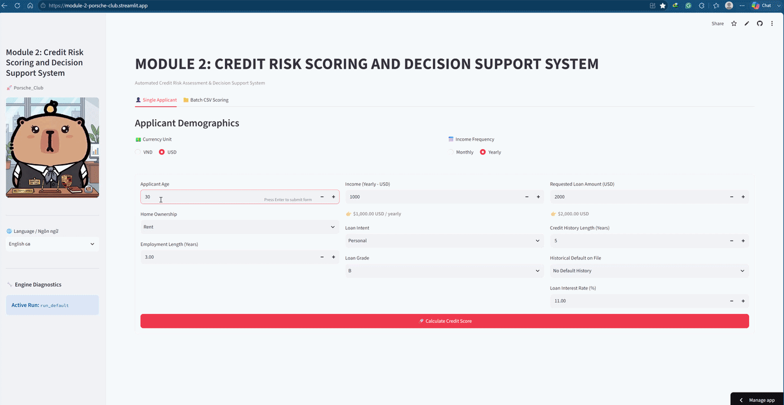
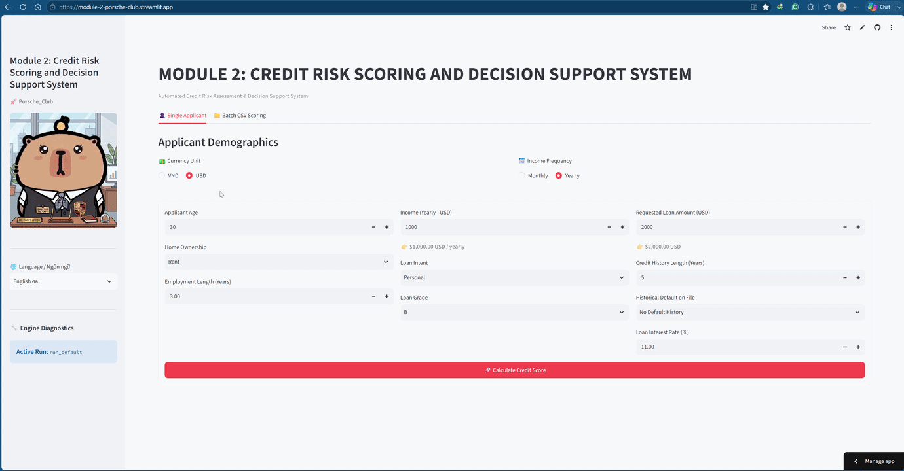

# 💳 Credit Risk Scoring & Decision Support System

> **Module 02 Project - End-to-End MLOps Credit Scorecard Pipeline & Interactive Web Application**

[](https://www.python.org/)
[](https://streamlit.io/)
[](https://huggingface.co/datasets/trungcan94/AIO_moddule_2_model)
[]()

---

## 📌 1. Project Overview

The **Credit Risk Scoring and Decision Support System** is a comprehensive, production-grade MLOps solution engineered for Commercial Banking and FinTech underwriting automation.

Built on strict credit risk principles (WOE Encoding, Logistic Regression Scaling, PDO Calibration), the system generates highly interpretable Business Scorecards while adhering to rigorous regulatory compliance standards:

- **Strict Anti-Data Leakage Architecture:** Enforces early 2-way Stratified Partitioning (80% Train / 20% Test) prior to any data cleaner fitting or WOE binning.
- **Dual-Mode Data Preprocessing (Notebook Sync Validation):** Features a production-ready _MLOps Mode_ (Winsorization/Capping to preserve 100% records) alongside a strict _Notebook Sync Mode_. Because the legacy Jupyter notebook manually hard-drops anomalies (e.g., missing employment lengths, extreme ages > 100) before splitting, this pipeline explicitly intercepts and mirrors these drops to ensure 100% mathematical verification and exact replication of the legacy baselines.
- **Tri-Branch Feature Selection:** Compares an IV-screened baseline against Pre-decision financial and explainable subsets using rigorous 10-Fold Cross-Validation (1-SE Rule).
- **Financial Calibration & Regulatory Compliance:** Achieves a Mean Absolute Error (MAE) of $\approx 0.62$ score points, near-perfect calibration variance ($1.0102 \approx 1.0$), and enforces strictly negative risk coefficients ($\beta < 0$).
- **MLOps Cloud Auto-Sync:** Packages production binaries into `model.zip` upon training completion and automatically syncs them with Hugging Face Hub for instant Streamlit Cloud deployment.
- **Role-Based Security Control:** Integrates an Underwriter Security Gate (`admin123` passcode) to hide sensitive score attribution charts and proprietary scaling tables from public applicant views.

---

## 👥 2. Team & Contributors

- **Project Title:** Credit Risk Scoring and Decision Support System
- **Team Name:** `Porsche_Club`
- **Organization:** AIO CONQUER
- **Repository:** [AIVIETNAM-AIO-trungcan/Module-2](https://github.com/AIVIETNAM-AIO-trungcan/Module-2)

| No. | Member Name          | Role & Core Responsibilities                                                                                                                                        | GitHub Profile                                                           |
| :-: | :------------------- | :------------------------------------------------------------------------------------------------------------------------------------------------------------------ | :----------------------------------------------------------------------- |
|  1  | **Trần Phương Bình** | **Tech Leader**<br>• System architecture oversight & technical compliance<br>• Risk modeling audit & project roadmap execution                                      | [@AIVIETNAM-AIO-TPBINH](https://github.com/AIVIETNAM-AIO-TPBINH)         |
|  2  | **Đào Trung Can**    | **AI Engineer (Pipeline)**<br>• Master pipeline engineering (`main.py`, `src/`)<br>• Scorecard scaling, PDO calibration & Hugging Face MLOps auto-sync              | [@AIVIETNAM-AIO-trungcan](https://github.com/AIVIETNAM-AIO-trungcan)     |
|  3  | **Cao Bá Hoàng**     | **AI Engineer (Model)**<br>• Model selection, hyperparameter tuning & LASSO CV optimization<br>• Regulatory beta audits & risk coefficient verification             | [@AIVIETNAM-AIO-CaoBaHoang](https://github.com/AIVIETNAM-AIO-CaoBaHoang) |
|  4  | **Nguyễn Tùng**      | **AI Engineer (Data)**<br>• Tier-1 Data Cleaner, outlier capping & Tier-2 WOE Binning engine<br>• Data leakage prevention & feature information value (IV) analysis | [@AIVIETNAM-AIO-Jayn79](https://github.com/AIVIETNAM-AIO-Jayn79)         |
|  5  | **Vũ Khánh Vy**      | **QA / Reviewer**<br>• Underwriting security testing & Streamlit UI quality assurance<br>• Documentation audit & business scorecard rulebook validation             | [@Whoami-404-pip](https://github.com/Whoami-404-pip)                     |

---

## 📂 3. Repository Directory Structure

```text
Module-2/
├── .vscode/                         # IDE workspace configurations
├── artifacts/                       # MLOps isolated run storage
│   └── runs/                        # Dynamic execution run logs (e.g., 2026-08-03_run_8)
│       ├── data/                    # Processed WOE datasets and score-transformed tables
│       ├── metrics/                 # JSON reports of model performance (KS, Gini, MAE)
│       ├── models/                  # Serialized binary model packages (.pkl files)
│       │   ├── baseline_logistic_model.pkl  # Baseline Logistic Regression Model (Champion)
│       │   ├── cleaner.pkl                  # Tier-1 Statistical Cleaner artifact
│       │   ├── feature_selector.pkl         # Tier-3 Feature Selection artifact
│       │   ├── score_scaler.pkl             # Financial Score Scaling parameters
│       │   └── woe_transformer.pkl          # Tier-2 WOE Binning engine artifact
│       ├── plots/                   # Generated evaluation charts (ROC, KS Curves, Monotonicity)
│       └── tables/                  # Business Scorecard Lookup Tables & QA audit logs (.csv)
├── asset/                           # Project visual assets & mascot images
├── checklist/                       # Governance & project verification checklists
├── data/                            # Dataset directory (contains raw credit data)
├── notebook/                        # Exploratory Data Analysis (EDA) & experimental notebooks
├── src/                             # Core Library Modules
│   ├── __init__.py                  # Python package initializer
│   ├── config.py                    # System path constants & configurations
│   ├── data_loader.py               # Raw data loader & Stratified Train/Test partitioning
│   ├── feature_selection.py         # Tier-3 Tri-Branch Feature Selector
│   ├── inference.py                 # Production Inference Engine with Auto-Cloud Recovery
│   ├── model.py                     # Logistic Regression Model Trainer & Regulatory Beta Audits
│   ├── preprocessing.py             # Tier-1 Statistical Cleaner & Tier-2 WOE Engine
│   ├── scorecard.py                 # Financial Score Scaling (Base Score, PDO, Factor/Offset)
│   └── utils.py                     # Performance Evaluation, ROC Plots & Strategy Simulation
├── .env                             # Environment secrets file (HF_TOKEN) - Excluded via .gitignore
├── .gitignore                       # Git rules ignoring binaries, cache files, and zip packages
├── app.py                           # Application UI Entrypoint (Streamlit Interactive Web App)
├── config.yaml                      # Centralized pipeline configuration & hyperparameters
├── LICENSE                          # Open-source license declaration
├── main.py                          # Master Pipeline Execution Engine (Training, Audit & Cloud Sync)
├── README.md                        # Technical project documentation
├── requirements.txt                 # Project environment dependencies
└── ui_config.yaml                   # UI layout settings, i18n localization, and admin passcode
```

## 🔄 4. Project Pipeline Architecture

The end-to-end workflow from raw data ingestion to automated cloud deployment:.



## 📊 5. Technical Performance & Audit Metrics

The selected Champion Model (`Intermediate Pre-decision Full Financial`) exhibits excellent discrimination capability without signs of overfitting across all populations:

| Metric Category              | Performance Indicator                                                                        | Benchmark / Target                     | Audit Status  |
| :--------------------------- | :------------------------------------------------------------------------------------------- | :------------------------------------- | :-----------: |
| **Model Discrimination**     | **ROC-AUC:** `0.8320`<br>**KS Index:** `0.5011` (Test Set)<br>**Gini Coefficient:** `0.6639` | AUC > 0.75<br>KS > 0.40<br>Gini > 0.60 | 🟢 Excellent  |
| **Probabilistic Accuracy**   | **Brier Score:** `0.1129`<br>**Log Loss:** `0.3709`                                          | Brier < 0.20<br>Log Loss < 0.50        |  🟢 Optimal   |
| **Classification (Default)** | **F1-Score:** `0.5836`<br>**Recall (Sensitivity):** `0.6791`<br>**Precision:** `0.5116`      | F1 > 0.50<br>Recall > 0.60             |  🟢 Optimal   |
| **Score Calibration**        | **Mean Absolute Error (MAE):** `0.6160` pts<br>**Calibration Variance Ratio:** `1.0102`      | MAE < 1.0 pt<br>Ratio $\approx 1.0$    | 🟢 Calibrated |
| **Regulatory Trend Audit**   | **Economic Logic:** $100\%$ negative coefficients ($\beta < 0$)                              | Monotonic Trend                        | 🟢 Compliant  |

> > 📄 **Full Technical Documentation:** [Download Full Technical Audit Report (.PDF)](https://drive.google.com/file/d/1hcO1-CbHj6eSLq2Ao-x_QFpZB9LTFz5z/view?usp=sharing)

---

### 🧮 5.1. Production Scorecard Rulebook

The final output of the pipeline is a highly interpretable, regulatory-compliant scorecard.

- **Scaling Setup:** Base Score = `600`, Base Odds = `50:1`, PDO = `20`.
- **Intercept Points:** `525` pts.

#### 📈 Feature-Level Point Allocations

<details>
<summary><b>🔍 View Detailed Scorecard Points Allocation Table (Click to expand)</b></summary>

| Feature                       | Bin / Category    |   WOE   | Allocated Points |
| :---------------------------- | :---------------- | :-----: | :--------------: |
| **person_income**             | Bin_0             | -1.4456 |     **-32**      |
|                               | Bin_1             | -0.8843 |     **-19**      |
|                               | Bin_2             | -0.2662 |      **-6**      |
|                               | Bin_3             | 0.0249  |      **1**       |
|                               | Bin_4             | 0.4254  |      **9**       |
|                               | Bin_5             | 0.9946  |      **22**      |
| **loan_intent**               | VENTURE           | 0.4918  |      **17**      |
|                               | EDUCATION         | 0.2978  |      **10**      |
|                               | PERSONAL          | 0.1381  |      **5**       |
|                               | HOMEIMPROVEMENT   | -0.2227 |      **-8**      |
|                               | MEDICAL           | -0.2940 |     **-10**      |
|                               | DEBTCONSOLIDATION | -0.3784 |     **-13**      |
| **person_home_ownership**     | OWN               | 1.3600  |      **35**      |
|                               | MORTGAGE          | 0.6457  |      **17**      |
|                               | RENT              | -0.4934 |     **-13**      |
|                               | OTHER             | -0.4934 |     **-13**      |
| **cb_person_default_on_file** | N                 | 0.2166  |      **7**       |
|                               | Y                 | -0.7783 |     **-26**      |
| **person_emp_length**         | Bin_0             | -0.3469 |      **-4**      |
|                               | Bin_1             | -0.2312 |      **-3**      |
|                               | Bin_2             | 0.0702  |      **1**       |
|                               | Bin_3             | 0.1777  |      **2**       |
|                               | Bin_4             | 0.2479  |      **3**       |
|                               | Bin_5             | 0.4272  |      **5**       |
| **loan_amnt**                 | Bin_0             | 0.1131  |      **3**       |
|                               | Bin_1             | 0.4205  |      **10**      |
|                               | Bin_2             | 0.1425  |      **3**       |
|                               | Bin_3             | -0.0091 |      **0**       |
|                               | Bin_4             | -0.3177 |      **-7**      |
|                               | Bin_5             | -0.6532 |     **-15**      |
| **loan_percent_income**       | Bin_0             | 0.8387  |      **21**      |
|                               | Bin_1             | 0.6078  |      **15**      |
|                               | Bin_2             | 0.2139  |      **5**       |
|                               | Bin_3             | -0.1895 |      **-5**      |
|                               | Bin_4             | -2.0557 |     **-51**      |
|                               | Bin_5             | -2.3066 |     **-57**      |

_(Note: Missing and Special categorical bins dynamically default to 0 points to handle unexpected inputs safely)._

</details>

## 🌐 6. Product Demo & Media Showcase

### 🎥 Streamlit Application Live Preview

---

> 🚀 **Live Interactive Web Application**
>
> Experience the automated credit scoring and decision support system online:
> 👉 **[CLICK HERE FOR LIVE STREAMLIT DEMO](https://module-2-porsche-club.streamlit.app/)**

> 🎬 **Full Walkthrough demo**
> Demo for tab 1: Single Application

<p align="center">
  
  <br>
  <em>Interactive Web Application Walkthrough: Single Application.</em>
</p>

> Demo for tab 2: Batch CSV Scoring

<p align="center">
  
  <br>
  <em>Interactive Web Application Walkthrough: Batch CSV Scoring.</em>
</p>
---

## 🛠️ 7. Quick Start Guide (Local Setup)

### Prerequisites

- **Python 3.10+** (Python 3.13 recommended)
- **Git** installed on local environment

### Step-by-Step Installation

1. **Clone the repository:**

```Bash
git clone https://github.com/AIVIETNAM-AIO-trungcan/Module-2.git
cd Module-2
```

2. **Install environment dependencies:**

```Bash
pip install -r requirements.txt
```

3. **Configure environment variables (Optional for Cloud Sync):**
   Create a .env file in the root directory to enable automatic model upload to Hugging Face:

```env
HF_TOKEN=hf_your_actual_write_access_token
```

4. **Run the master training pipeline:**

```Bash
python main.py
```

5. **Launch the Streamlit Web Application:**

```Bash
streamlit run app.py
```

---

_Developed by **Porsche_Club** - Module 02 Credit Risk Scoring & Decision Support System._
